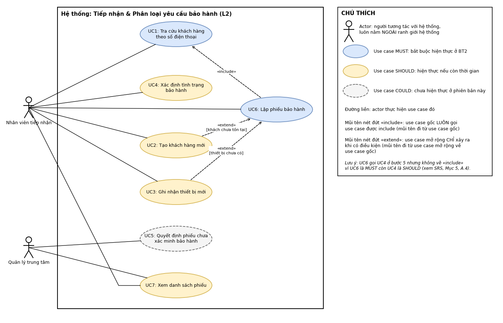

# BẢN ĐẶC TẢ YÊU CẦU PHẦN MỀM (SRS RÚT GỌN)

**Hệ thống:** Smart CRM Mekong Mobile
**Luồng nghiệp vụ:** L2 – Tiếp nhận và phân loại yêu cầu bảo hành
**Sinh viên:** Võ Phạm Việt Phú · **MSSV:** 2374802010391 · **Track:** Công nghệ Phần mềm (SE)
**Học phần:** Chuyên đề tốt nghiệp 1

---

## 1. Giới thiệu và phạm vi

### 1.1. Bối cảnh

Mekong Mobile là chuỗi 24 cửa hàng và 6 trung tâm bảo hành, trung bình 260 phiếu bảo hành mỗi tháng. Phiếu hiện được ghi trên giấy, mỗi trung tâm lưu một cách, nên không ai biết phiếu đang ở bước nào (khoảng 15% phiếu quá hạn mà không được cảnh báo, vấn đề V2). Mô tả lỗi ghi tự do, không phân nhóm, nên không thống kê được nguyên nhân bảo hành (V8). Cuối ngày nhân viên tiếp nhận phải chép lại phiếu sang Excel, mất khoảng 40 phút.

### 1.2. Phạm vi

Nhân viên tiếp nhận tra cứu khách theo số điện thoại, ghi nhận thiết bị, xác định tình trạng bảo hành, chọn nhóm sự cố và mức ưu tiên để lập phiếu bảo hành có mã và hạn cam kết, kết thúc khi phiếu được lưu ở trạng thái MỚI; quản lý trung tâm xem danh sách phiếu của trung tâm mình theo hạn cam kết.

### 1.3. Điều chủ ý KHÔNG làm (WON'T)

| Mã  | Nội dung không làm                                                                              | Lý do                                                                                  |
| --- | ----------------------------------------------------------------------------------------------- | -------------------------------------------------------------------------------------- |
| W1  | Phân công kỹ thuật viên, đặt lịch hẹn                                                           | Thuộc luồng L4                                                                         |
| W2  | Đổi trạng thái phiếu sau MỚI và đóng phiếu                                                      | Thuộc các luồng L4, L5                                                                 |
| W3  | Quản lý tồn kho, xuất linh kiện                                                                 | Thuộc luồng L5                                                                         |
| W4  | Khảo sát hài lòng sau bảo hành                                                                  | Thuộc luồng L8                                                                         |
| W5  | Tự động phân loại nhóm sự cố (luật hoặc học máy)                                                | Thuộc luồng L10; bản này nhân viên tự chọn nhóm từ danh mục                            |
| W6  | Báo cáo tổng hợp, dashboard toàn công ty                                                        | Thuộc luồng L6                                                                         |
| W7  | Gộp hồ sơ khách hàng trùng                                                                      | Thuộc luồng L1, L7                                                                     |
| W8  | Đính kèm ảnh, in phiếu, gửi tin nhắn cho khách; sửa, xóa khách hàng; hủy phiếu                  | Mức COULD, ghi vào hướng mở rộng                                                       |
| W9  | Tìm phiếu theo mã phiếu hoặc số điện thoại; lọc danh sách phiếu theo trạng thái                 | Mức COULD; lọc theo trạng thái chỉ có nghĩa khi L4, L5 đổi trạng thái phiếu (xem W2)   |
| W10 | Cảnh báo thiết bị đã sửa từ 3 lần trở lên cùng một lỗi (gợi ý của anh Dũng, kỹ thuật viên)      | Cần lịch sử sửa chữa theo thiết bị; thuộc luồng L4 và hướng mở rộng                    |
| W11 | Màn hình quản trị danh mục nhóm sự cố; xử lý ngày lễ khi tính hạn cam kết                       | Mức COULD; bản này cập nhật danh mục bằng dữ liệu cấu hình                             |

### 1.4. Thuật ngữ

| Thuật ngữ            | Định nghĩa                                                                          | Tên kỹ thuật       |
| -------------------- | ----------------------------------------------------------------------------------- | ------------------ |
| Khách hàng           | Cá nhân đã mua sản phẩm hoặc dùng dịch vụ của Mekong Mobile                         | customer           |
| Thiết bị             | Một máy cụ thể của khách, xác định bằng serial/IMEI                                 | device             |
| Phiếu bảo hành       | Một yêu cầu bảo hành hoặc sửa chữa, có mã duy nhất và vòng đời trạng thái           | ticket             |
| Trạng thái phiếu     | Vị trí của phiếu trong vòng đời; trong phạm vi L2 chỉ dùng trạng thái MỚI           | ticket_status      |
| Lịch sử trạng thái   | Bản ghi mỗi lần phiếu đổi trạng thái: trạng thái trước và sau, thời điểm, người thực hiện | ticket_status_log |
| Hạn cam kết          | Thời điểm chậm nhất phải hoàn tất phiếu, tính từ lúc tiếp nhận theo mức ưu tiên     | due_date           |
| Nhóm sự cố           | Phân loại nguyên nhân: màn hình, pin, sạc, phần mềm, nước vào, khác                 | issue_category     |
| Mức ưu tiên          | Cao, Trung bình, Thấp; quyết định hạn cam kết                                       | priority           |
| Tình trạng bảo hành  | Còn bảo hành, hết bảo hành, hoặc chưa xác minh bảo hành (thiếu ngày mua)            | warranty_status    |
| Trung tâm bảo hành   | Đơn vị tiếp nhận và xử lý phiếu; nhân viên và quản lý chỉ thuộc một trung tâm       | service_center     |

[//]: # (**Quy ước dùng từ:** toàn bộ tài liệu và sơ đồ chỉ dùng "**lập** phiếu bảo hành" &#40;không dùng "tạo phiếu"&#41;, "**xác định** tình trạng bảo hành" &#40;không dùng "kiểm tra"&#41;, và "chưa xác minh bảo hành" &#40;không rút gọn thành "chưa xác minh"&#41;. "Tạo" chỉ dùng cho khách hàng mới.)

---

## 2. Các bên liên quan và vai trò người dùng

| Vai trò             | Được làm                                                                                                                                                  | Không được làm                                                                                                                                   |
| :------------------ | :-------------------------------------------------------------------------------------------------------------------------------------------------------- | :----------------------------------------------------------------------------------------------------------------------------------------------- |
| Nhân viên tiếp nhận | Tra cứu và tạo khách hàng, ghi nhận thiết bị, xác định tình trạng bảo hành, lập phiếu bảo hành, chọn nhóm sự cố và mức ưu tiên, xem phiếu của trung tâm mình | Xem số điện thoại đầy đủ (chỉ thấy dạng che); quyết định phiếu chưa xác minh bảo hành; xem phiếu của trung tâm khác; xóa phiếu hoặc khách hàng (QT-13) |
| Quản lý trung tâm   | Xem toàn bộ phiếu của trung tâm mình, quyết định phiếu chưa xác minh bảo hành, xem số điện thoại đầy đủ                                                    | Xem phiếu của trung tâm không phụ trách; xóa vật lý phiếu hoặc khách hàng (QT-13)                                                                |

---

## 3. Yêu cầu chức năng

### 3.1. Danh sách yêu cầu chức năng

| Mã   | Yêu cầu chức năng                                                                                                                                                                                                                                                  |
| ---- | ------------------------------------------------------------------------------------------------------------------------------------------------------------------------------------------------------------------------------------------------------------------ |
| FR1  | Hệ thống cho phép tra cứu khách hàng theo số điện thoại; số nhập vào được chuẩn hóa về 10 chữ số bắt đầu bằng 0 trước khi tra; nếu tìm thấy thì hiển thị hồ sơ khách.                                                                                              |
| FR2  | Hệ thống cho phép tạo khách hàng mới khi số điện thoại chưa tồn tại; họ tên và số điện thoại là bắt buộc, số điện thoại không được trùng.                                                                                                                          |
| FR3  | Hệ thống hiển thị danh sách thiết bị của khách (tên máy, serial/IMEI, ngày mua) và cho chọn một thiết bị để lập phiếu.                                                                                                                                              |
| FR4  | Hệ thống cho phép ghi nhận thiết bị mới cho khách; tên máy (chọn từ danh mục sản phẩm) và serial/IMEI là bắt buộc, serial/IMEI không được trùng; ngày mua được để trống; số tháng bảo hành lấy theo sản phẩm, mặc định 12.                                           |
| FR5  | Hệ thống xác định tình trạng bảo hành tại thời điểm tiếp nhận và hiển thị một trong ba kết quả: còn bảo hành, hết bảo hành, chưa xác minh bảo hành (thiếu ngày mua).                                                                                                |
| FR6  | Hệ thống cho phép Quản lý trung tâm quyết định "miễn phí" hoặc "có tính phí" cho phiếu chưa xác minh bảo hành, kèm lý do. _(COULD, chưa hiện thực)_                                                                                                                |
| FR7  | Hệ thống cho phép lập phiếu với các trường bắt buộc: khách hàng, thiết bị, mô tả lỗi (trung tâm do hệ thống điền theo trung tâm của nhân viên); khi lưu thì sinh mã phiếu duy nhất, đặt trạng thái MỚI, ghi thời điểm tiếp nhận và dòng lịch sử trạng thái đầu tiên. |
| FR8  | Hệ thống cho phép chọn nhóm sự cố từ danh mục có sẵn; nhóm sự cố không bắt buộc, nếu không chọn thì phiếu được lưu với nhóm để trống (chưa phân loại).                                                                                                              |
| FR9  | Hệ thống điền sẵn mức ưu tiên theo mặc định của nhóm sự cố đã chọn (Trung bình nếu chưa chọn nhóm) và cho nhân viên đổi sang Cao, Trung bình hoặc Thấp.                                                                                                            |
| FR10 | Hệ thống tự sinh hạn cam kết từ thời điểm tiếp nhận: Cao 24 giờ, Trung bình 72 giờ, Thấp 120 giờ, không tính Chủ nhật.                                                                                                                                             |
| FR11 | Hệ thống hiển thị danh sách phiếu của trung tâm mình, sắp theo hạn cam kết tăng dần, phân trang 20 dòng.                                                                                                                                                           |
| FR12 | Hệ thống đánh dấu phiếu quá hạn: phiếu có hạn cam kết sớm hơn thời điểm hiện tại và chưa ở trạng thái Hoàn tất hoặc Đã đóng.                                                                                                                                       |

### 3.2. User Story và mức MoSCoW

| Mã  | User Story                                                                                                                                                                                                  | MoSCoW     |
| --- | ----------------------------------------------------------------------------------------------------------------------------------------------------------------------------------------------------------- | ---------- |
| US1 | **Là nhân viên tiếp nhận**, tôi muốn tra cứu khách bằng số điện thoại và xem danh sách thiết bị của khách để không phải hỏi lại tên, địa chỉ và máy khách đã mua.                                           | **MUST**   |
| US2 | **Là nhân viên tiếp nhận**, tôi muốn tạo hồ sơ cho khách chưa có trong hệ thống ngay lúc tiếp nhận để không phải ghi tay rồi nhập bổ sung.                                                                  | **SHOULD** |
| US3 | **Là nhân viên tiếp nhận**, tôi muốn ghi nhận thiết bị chưa có trong hệ thống để vẫn tiếp nhận được máy mà không phải làm giấy riêng.                                                                       | **SHOULD** |
| US4 | **Là nhân viên tiếp nhận**, tôi muốn biết thiết bị còn hay hết bảo hành, hoặc chưa xác minh bảo hành, để không phải lật sổ hay gọi cửa hàng tra ngày mua.                                                    | **SHOULD** |
| US5 | **Là quản lý trung tâm**, tôi muốn quyết định các phiếu chưa xác minh bảo hành (miễn phí hay có tính phí, kèm lý do) để tránh tranh chấp do nhân viên tự ghi "còn bảo hành".                                 | **COULD**  |
| US6 | **Là nhân viên tiếp nhận**, tôi muốn lập phiếu bảo hành có mã duy nhất để mỗi yêu cầu đều được theo dõi, không còn phiếu giấy thất lạc và không phải chép lại sang Excel cuối ngày.                          | **MUST**   |
| US7 | **Là nhân viên tiếp nhận**, tôi muốn phân loại phiếu bằng cách chọn nhóm sự cố từ danh mục có sẵn (mức ưu tiên được điền sẵn theo nhóm) để phân loại nhất quán giữa các nhân viên và thống kê được nguyên nhân phổ biến. | **SHOULD** |
| US8 | **Là nhân viên tiếp nhận**, tôi muốn hệ thống tự sinh hạn cam kết để hẹn ngày trả máy có căn cứ thay vì ước lượng theo kinh nghiệm cá nhân.                                                                  | **MUST**   |
| US9 | **Là quản lý trung tâm**, tôi muốn xem danh sách phiếu của trung tâm sắp theo hạn cam kết, có đánh dấu phiếu quá hạn, để xử lý phiếu sắp trễ trước và không phải ngồi đếm tay số phiếu quá hạn.             | **SHOULD** |

### 3.3. Tiêu chí chấp nhận cho các story MUST

#### US1

- **AC1.** GIVEN số 0901234567 đã có trong hệ thống, WHEN nhân viên nhập số này (hoặc +84901234567), THEN hệ thống hiển thị đúng hồ sơ khách và danh sách thiết bị.
- **AC2 (ngoại lệ).** GIVEN số điện thoại chưa có trong hệ thống, WHEN nhân viên tra cứu, THEN hệ thống báo không tìm thấy và đề nghị tạo khách mới.
- **AC3 (ngoại lệ).** GIVEN số nhập vào không đủ 10 chữ số sau khi chuẩn hóa, WHEN nhân viên tra cứu, THEN hệ thống từ chối và nêu rõ lý do.

#### US6

- **AC1.** GIVEN khách, thiết bị và mô tả lỗi hợp lệ, WHEN nhân viên bấm Lưu phiếu, THEN phiếu được lưu với mã duy nhất, trạng thái MỚI, có thời điểm tiếp nhận và một dòng lịch sử trạng thái đầu tiên.
- **AC2 (ngoại lệ).** GIVEN mô tả lỗi để trống hoặc dưới 10 ký tự, WHEN bấm Lưu phiếu, THEN hệ thống từ chối, nêu rõ trường chưa hợp lệ và giữ nguyên dữ liệu đã nhập.
- **AC3 (ngoại lệ).** GIVEN thiết bị được chọn không thuộc khách đang tiếp nhận, WHEN bấm Lưu phiếu, THEN hệ thống từ chối và thông báo thiết bị không thuộc khách hàng này.

#### US8

- **AC1.** GIVEN phiếu mức CAO tiếp nhận lúc 09:00 thứ Hai, WHEN lưu phiếu, THEN hạn cam kết là 09:00 thứ Ba.
- **AC2.** GIVEN phiếu mức TRUNG_BINH tiếp nhận lúc 14:30 thứ Năm, WHEN lưu phiếu, THEN hạn cam kết là 14:30 thứ Hai tuần sau (bỏ qua Chủ nhật).
- **AC3 (ngoại lệ).** GIVEN phiếu mức CAO tiếp nhận lúc 10:00 thứ Bảy, WHEN lưu phiếu, THEN hạn cam kết là 10:00 thứ Hai, không rơi vào Chủ nhật.

---

## 4. Yêu cầu phi chức năng

| Mã   | Loại       | Yêu cầu (có ngưỡng đo được)                                                                                                                                                                                                                | Cách kiểm chứng                                                                       |
| :--- | :--------- | :----------------------------------------------------------------------------------------------------------------------------------------------------------------------------------------------------------------------------------------- | :------------------------------------------------------------------------------------ |
| NFR1 | Hiệu năng  | Trang đầu (20 dòng) của danh sách phiếu hiển thị dưới 2 giây với 10.000 phiếu; tra cứu khách theo số điện thoại dưới 1 giây với 65.000 hồ sơ                                                                                               | Nạp dữ liệu mẫu, đo thời gian phản hồi                                                |
| NFR2 | Bảo mật    | Nhân viên tiếp nhận chỉ thấy số điện thoại khách ở dạng che 4 số (ví dụ 090\*\*\*\*567); chỉ Quản lý trung tâm thấy đầy đủ. Đúng ở 100% màn hình và 100% kết quả trả về.                                                                  | Đăng nhập lần lượt hai vai trò, kiểm tra từng màn hình và từng phản hồi API           |
| NFR3 | Khả dụng   | Một nhân viên tiếp nhận mới, chưa được hướng dẫn, lập xong một phiếu bảo hành đúng trong dưới 3 phút.                                                                                                                                      | Cho 3 người thử, bấm giờ từng người                                                   |
| NFR4 | Tin cậy    | Bản ghi phiếu và dòng lịch sử trạng thái đầu tiên được lưu trong một giao dịch; khi mất kết nối hoặc lỗi giữa chừng, có 0 phiếu lưu thiếu lịch sử và 0 phiếu trùng mã khi nhân viên thử lưu lại.                                           | Giả lập ngắt kết nối ở 20 lần lưu liên tiếp, đếm phiếu thiếu lịch sử hoặc trùng mã    |
| NFR5 | Bảo trì    | Thêm một nhóm sự cố mới hoặc đổi mức ưu tiên mặc định của một nhóm chỉ cần thêm hoặc sửa 1 dòng dữ liệu danh mục; 0 dòng mã nguồn phải sửa và không cần triển khai lại.                                                                    | Thêm thử một nhóm mới vào danh mục, kiểm tra nhóm xuất hiện trên form lập phiếu       |

---

## 5. Ràng buộc và quy tắc nghiệp vụ

| Mã    | Quy tắc                                                                                                                                                         | Liên quan             |
| ----- | --------------------------------------------------------------------------------------------------------------------------------------------------------------- | --------------------- |
| QT-01 | Số điện thoại khách là duy nhất; nhập số đã tồn tại thì hiển thị hồ sơ có sẵn, không tạo mới.                                                                   | FR1, FR2              |
| QT-02 | Số điện thoại được chuẩn hóa về 10 chữ số bắt đầu bằng 0 (chấp nhận +84…, 84…, dấu cách, dấu chấm).                                                             | FR1, FR2              |
| QT-03 | Thiết bị xác định duy nhất bằng serial/IMEI; một thiết bị chỉ thuộc một khách tại một thời điểm.                                                                | FR4, FR7              |
| QT-04 | Hạn cam kết: Cao 24 giờ, Trung bình 72 giờ, Thấp 120 giờ; chỉ tính thứ Hai đến thứ Bảy.                                                                         | FR10                  |
| QT-05 | Còn bảo hành nếu (ngày tiếp nhận − ngày mua) ≤ số tháng bảo hành; thiếu ngày mua thì "chưa xác minh bảo hành", cần quản lý duyệt (chức năng duyệt là mức COULD).  | FR5, FR6              |
| QT-06 | Mọi lần chuyển trạng thái đều phải ghi vào lịch sử; trong phạm vi L2, phiếu mới lập ở trạng thái MỚI và ghi dòng lịch sử đầu tiên.                              | FR7                   |
| QT-13 | Không xóa vật lý phiếu, đơn hàng, hồ sơ khách; chỉ đánh dấu ngừng sử dụng.                                                                                      | Tất cả                |
| QT-14 | Nhân viên chỉ xem dữ liệu của trung tâm mình; quản lý xem toàn bộ đơn vị phụ trách.                                                                             | FR11, FR12, NFR2      |
| QT-15 | Số điện thoại hiển thị dạng che với mọi vai trò trừ Quản lý và Ban giám đốc.                                                                                    | NFR2                  |

**Giả định của luồng:**

- Hạn cam kết cộng đủ số giờ theo mức ưu tiên và cộng thêm 24 giờ cho mỗi Chủ nhật đi qua. Phiếu tiếp nhận vào Chủ nhật được tính từ 00:00 thứ Hai. Ngày lễ chưa được xét (W11).
- Phiếu hết bảo hành vẫn được lập và ghi là có tính phí.
- Xác định tình trạng bảo hành đầy đủ theo QT-05 (UC4) là mức SHOULD. Khi UC4 chưa hiện thực, bước xác định bảo hành trong UC6 mặc định trả về "chưa xác minh bảo hành" và không bao giờ hiển thị "còn bảo hành".
- Phiếu chưa xác minh bảo hành vẫn được lập và đánh dấu "chờ quản lý quyết định". Chức năng quyết định (UC5) là mức COULD nên ở bản này phiếu giữ nguyên dấu hiệu chờ.
- Phiếu quá hạn là phiếu có hạn cam kết sớm hơn thời điểm hiện tại và chưa Hoàn tất hoặc Đã đóng. Vì L2 chỉ lập phiếu MỚI (W2), dữ liệu để thử danh sách và đánh dấu quá hạn lấy từ `tickets_history.csv` của case study (có nhiều trạng thái).

---

## 6. Bảng truy vết yêu cầu

| Mã FR | Yêu cầu chức năng (rút gọn)                                     | User Story | Use Case | MoSCoW | Test case (BT3) |
| ----- | --------------------------------------------------------------- | ---------- | -------- | ------ | --------------- |
| FR1   | Tra cứu khách theo số điện thoại (có chuẩn hóa số)              | US1        | UC1      | MUST   | BT3             |
| FR2   | Tạo khách mới khi số điện thoại chưa tồn tại                    | US2        | UC2      | SHOULD | BT3             |
| FR3   | Hiển thị danh sách thiết bị của khách và chọn thiết bị          | US1        | UC1      | MUST   | BT3             |
| FR4   | Ghi nhận thiết bị mới chưa có trong danh sách                   | US3        | UC3      | SHOULD | BT3             |
| FR5   | Xác định tình trạng bảo hành (còn / hết / chưa xác minh)        | US4        | UC4      | SHOULD | BT3             |
| FR6   | Quản lý quyết định phiếu chưa xác minh bảo hành                 | US5        | UC5      | COULD  | — (không hiện thực) |
| FR7   | Lập phiếu: sinh mã, trạng thái MỚI, ghi lịch sử đầu tiên        | US6        | UC6      | MUST   | BT3             |
| FR8   | Chọn nhóm sự cố từ danh mục (không bắt buộc)                    | US7        | UC6      | SHOULD | BT3             |
| FR9   | Điền sẵn mức ưu tiên theo nhóm, cho phép đổi                    | US7        | UC6      | SHOULD | BT3             |
| FR10  | Tự sinh hạn cam kết theo mức ưu tiên                            | US8        | UC6      | MUST   | BT3             |
| FR11  | Danh sách phiếu của trung tâm, sắp theo hạn cam kết             | US9        | UC7      | SHOULD | BT3             |
| FR12  | Đánh dấu phiếu quá hạn                                          | US9        | UC7      | SHOULD | BT3             |

---

# PHỤ LỤC

## Phụ lục A. Use Case Diagram



[//]: # (_File gốc có thể chỉnh sửa: `docs/usecase.drawio`._)

### A.1. Chú thích ký hiệu

| Ký hiệu                          | Ý nghĩa                                                                                                           |
| -------------------------------- | ----------------------------------------------------------------------------------------------------------------- |
| Hình người                       | Actor: người tương tác với hệ thống, luôn nằm ngoài ranh giới hệ thống                                            |
| Hình elip                        | Use case: một chức năng mà actor thực hiện, đặt tên dạng động từ + đối tượng                                      |
| Màu elip                         | Xanh dương = MUST; vàng = SHOULD; xám nét đứt = COULD (chưa hiện thực)                                            |
| Khung chữ nhật bao quanh         | Ranh giới hệ thống: mọi use case bên trong thuộc phạm vi L2                                                       |
| Đường liền nối actor và use case | Actor thực hiện use case đó                                                                                       |
| Mũi tên nét đứt `<<include>>`    | Use case gốc luôn gọi use case được include (bước bắt buộc); mũi tên đi từ use case gốc tới use case được include |
| Mũi tên nét đứt `<<extend>>`     | Use case mở rộng chỉ xảy ra khi có điều kiện; mũi tên đi từ use case mở rộng về use case gốc                      |

### A.2. Các actor

| Actor               | Vai trò trong sơ đồ                                                          | Use case thực hiện           |
| ------------------- | ---------------------------------------------------------------------------- | ---------------------------- |
| Nhân viên tiếp nhận | Tiếp nhận yêu cầu tại trung tâm bảo hành, là người dùng chính                | UC1, UC2, UC3, UC4, UC6, UC7 |
| Quản lý trung tâm   | Giám sát phiếu của trung tâm mình và quyết định phiếu chưa xác minh bảo hành | UC5, UC7                     |

### A.3. Các use case

| Mã  | Tên use case                            | Mô tả ngắn                                                                                       | User Story    | Ưu tiên |
| --- | --------------------------------------- | ------------------------------------------------------------------------------------------------ | ------------- | ------- |
| UC1 | Tra cứu khách hàng theo số điện thoại   | Tìm khách theo số điện thoại đã chuẩn hóa, hiển thị hồ sơ và thiết bị                            | US1           | MUST    |
| UC2 | Tạo khách hàng mới                      | Tạo hồ sơ khi số điện thoại chưa tồn tại                                                         | US2           | SHOULD  |
| UC3 | Ghi nhận thiết bị mới                   | Thêm thiết bị (bắt buộc tên máy và serial/IMEI) khi chưa có trong danh sách của khách            | US3           | SHOULD  |
| UC4 | Xác định tình trạng bảo hành            | Xác định còn bảo hành, hết bảo hành hoặc chưa xác minh bảo hành theo QT-05                       | US4           | SHOULD  |
| UC5 | Quyết định phiếu chưa xác minh bảo hành | Quản lý chọn miễn phí hoặc có tính phí, kèm lý do                                                | US5           | COULD   |
| UC6 | Lập phiếu bảo hành                      | Ghi nhận phiếu mới, chọn nhóm sự cố và mức ưu tiên, sinh mã phiếu và hạn cam kết                 | US6, US7, US8 | MUST    |
| UC7 | Xem danh sách phiếu                     | Quản lý trung tâm xem phiếu của trung tâm mình sắp theo hạn cam kết, đánh dấu quá hạn; nhân viên tiếp nhận xem được phiếu của trung tâm mình (QT-14) | US9 | SHOULD |

### A.4. Quan hệ giữa các use case

- UC6 `<<include>>` UC1: lập phiếu luôn bắt đầu bằng việc tra cứu khách.
- UC2 `<<extend>>` UC6: chỉ xảy ra khi khách chưa tồn tại trong hệ thống.
- UC3 `<<extend>>` UC6: chỉ xảy ra khi thiết bị chưa có trong danh sách của khách.
- UC4 **không** vẽ `<<include>>` với UC6. Bước 5 của UC6 luôn hiển thị một tình trạng bảo hành, nhưng UC6 là MUST còn UC4 đầy đủ là SHOULD, nên khi UC4 chưa hiện thực bước này mặc định trả về "chưa xác minh bảo hành" (xem Giả định ở Mục 5). Nếu UC4 được hiện thực, bước 5 dùng kết quả của UC4.

---

## Phụ lục B. Đặc tả use case UC6 – Lập phiếu bảo hành

### B.1. Thông tin chung

- **Actor chính:** Nhân viên tiếp nhận
- **Mục tiêu:** Ghi nhận một yêu cầu bảo hành vào hệ thống để theo dõi đến khi đóng.
- **Điều kiện trước:** Nhân viên đã đăng nhập, có quyền tiếp nhận và thuộc một trung tâm bảo hành.
- **Điều kiện sau:** Một phiếu ở trạng thái MỚI được lưu, có mã phiếu duy nhất, hạn cam kết và một dòng lịch sử trạng thái đầu tiên.
- **Liên quan:** US6, US7, US8 (include UC1; dùng UC4 ở bước 5 khi đã hiện thực) | **Mức ưu tiên:** MUST

### B.2. Luồng chính

1. Nhân viên chọn chức năng "Lập phiếu bảo hành mới".
2. Nhân viên nhập số điện thoại khách.
3. Hệ thống chuẩn hóa số, tra cứu và hiển thị thông tin khách cùng danh sách thiết bị. _[include UC1]_
4. Nhân viên chọn thiết bị cần bảo hành.
5. Hệ thống xác định tình trạng bảo hành và hiển thị kết quả: còn bảo hành, hết bảo hành, hoặc chưa xác minh bảo hành. _[UC4; mặc định "chưa xác minh bảo hành" nếu UC4 chưa hiện thực]_
6. Nhân viên nhập mô tả lỗi.
7. Nhân viên chọn nhóm sự cố (không bắt buộc); hệ thống điền sẵn mức ưu tiên mặc định của nhóm; nhân viên xác nhận hoặc đổi mức ưu tiên.
8. Nhân viên bấm Lưu phiếu.
9. Hệ thống kiểm tra dữ liệu, sinh mã phiếu, sinh hạn cam kết theo mức ưu tiên, lưu phiếu ở trạng thái MỚI, ghi lịch sử trạng thái và hiển thị mã phiếu cùng hạn cam kết.

### B.3. Luồng ngoại lệ

- **3a. Khách chưa tồn tại.** Hệ thống mở form tạo khách mới với số điện thoại đã điền sẵn _[extend UC2]_; sau khi lưu khách, quay lại bước 4.
- **3b. Số điện thoại không hợp lệ** (không đủ 10 chữ số sau khi chuẩn hóa). Hệ thống từ chối, nêu rõ lý do, cho nhập lại.
- **4a. Thiết bị chưa có trong danh sách của khách.** Cho nhập thiết bị mới, bắt buộc có tên máy và serial/IMEI _[extend UC3]_. Nếu serial đã thuộc khách khác, hệ thống từ chối (QT-03).
- **5a. Thiếu ngày mua.** Hệ thống hiển thị "chưa xác minh bảo hành", vẫn cho lập phiếu và đánh dấu phiếu chờ Quản lý trung tâm quyết định _[UC5]_. Đây là cách xử lý có kiểm soát cho "đường tránh" ở bước 4 của Mục 6.1 trong tài liệu case study.
- **5b. Hết bảo hành.** Hệ thống hiển thị cảnh báo; nhân viên vẫn lập phiếu được, phiếu được ghi là có tính phí.
- **7a. Nhân viên không chọn nhóm sự cố.** Hệ thống vẫn cho lưu, nhóm sự cố để trống (chưa phân loại) và mức ưu tiên mặc định là Trung bình.
- **9a. Mô tả lỗi để trống hoặc dưới 10 ký tự.** Hệ thống từ chối lưu, nêu rõ trường chưa hợp lệ, giữ nguyên dữ liệu đã nhập.
- **9b. Thiết bị được chọn không thuộc khách đang tiếp nhận** (QT-03). Hệ thống từ chối lưu và thông báo thiết bị không thuộc khách hàng này.
- **9c. Mất kết nối khi đang lưu.** Hệ thống giữ dữ liệu trên giao diện, cho thử lưu lại và không lập phiếu trùng (NFR4).

---

## Phụ lục C. Mẫu đặc tả riêng của track SE: Hợp đồng API

### C.1. Danh sách endpoint

| #  | Phương thức | Đường dẫn                                | Mục đích                                                    | User Story    | Vai trò gọi được            |
| -- | ----------- | ---------------------------------------- | ----------------------------------------------------------- | ------------- | --------------------------- |
| 1  | GET         | `/api/customers?phone={phone}`           | Tra cứu khách theo số điện thoại (đã chuẩn hóa)             | US1           | Tiếp nhận, Quản lý          |
| 2  | GET         | `/api/customers/{id}/devices`            | Lấy danh sách thiết bị của khách                            | US1           | Tiếp nhận, Quản lý          |
| 3  | POST        | `/api/customers`                         | Tạo khách hàng mới khi chưa tồn tại                         | US2           | Tiếp nhận                   |
| 4  | POST        | `/api/customers/{id}/devices`            | Ghi nhận thiết bị mới cho khách                             | US3           | Tiếp nhận                   |
| 5  | GET         | `/api/devices/{id}/warranty`             | Xác định tình trạng bảo hành của thiết bị                   | US4           | Tiếp nhận, Quản lý          |
| 6  | GET         | `/api/issue-categories`                  | Lấy danh mục nhóm sự cố kèm mức ưu tiên mặc định            | US7           | Tiếp nhận, Quản lý          |
| 7  | POST        | `/api/tickets`                           | Lập phiếu bảo hành mới                                      | US6, US7, US8 | Tiếp nhận                   |
| 8  | GET         | `/api/tickets?page=&size=`               | Danh sách phiếu của trung tâm, sắp theo hạn cam kết         | US9           | Tiếp nhận, Quản lý          |
| 9  | PATCH       | `/api/tickets/{id}/warranty-decision`    | Quản lý quyết định phiếu chưa xác minh bảo hành _(COULD, không hiện thực)_ | US5 | Quản lý                     |

### C.2. Quy ước chung

- Định dạng trao đổi: JSON, mã hóa UTF-8. Header bắt buộc: `Content-Type: application/json`.
- Xác thực: mọi endpoint yêu cầu header `Authorization: Bearer <token>`; token xác định vai trò (Tiếp nhận hoặc Quản lý) và trung tâm của người dùng.
- Tên trường dùng snake_case, bám theo tên cột trong cơ sở dữ liệu để dễ truy vết (đối chiếu lại với ERD khi chốt).
- Thời gian dùng chuẩn ISO 8601 kèm múi giờ, ví dụ `2026-10-08T14:30:00+07:00`; ngày dùng `YYYY-MM-DD`.
- Số điện thoại nhận vào ở nhiều dạng (QT-02), lưu và trả về dạng 10 chữ số. Với vai trò Tiếp nhận, mọi số điện thoại trả về đều ở dạng che (`090****567`); chỉ vai trò Quản lý nhận số đầy đủ (NFR2, QT-15).
- Chỉ trả dữ liệu của trung tâm mà người gọi thuộc về (QT-14); truy cập dữ liệu trung tâm khác trả `403`.
- Phân trang: `page` (bắt đầu từ 1) và `size` (mặc định 20, tối đa 100). Response kèm `total`.
- Mọi lỗi trả về cùng một cấu trúc: `{ "error": { "code": "...", "message": "...", "fields": {...} } }`.
- Mã lỗi dùng chung: `400 VALIDATION_FAILED`, `401 UNAUTHENTICATED`, `403 FORBIDDEN`, `404 NOT_FOUND`, `409 CONFLICT`, `422 BUSINESS_RULE_VIOLATION`.

### C.3. Chi tiết endpoint của các User Story MUST

#### C.3.1. `GET /api/customers?phone={phone}` · Tra cứu khách · US1

Request: `GET /api/customers?phone=%2B84901234567` (số được chuẩn hóa thành `0901234567` trước khi tra)

**Response 200 OK** (vai trò Tiếp nhận, số điện thoại bị che)

```json
{
  "customer_id": 1024,
  "full_name": "Nguyễn Văn An",
  "phone": "090****567",
  "email": null,
  "address": "12 Nguyễn Tri Phương, Quận 10"
}
```

**Response 400 Bad Request** (số không đủ 10 chữ số sau khi chuẩn hóa, AC3 của US1)

```json
{
  "error": {
    "code": "VALIDATION_FAILED",
    "message": "Số điện thoại không hợp lệ",
    "fields": { "phone": "Phải đủ 10 chữ số sau khi chuẩn hóa" }
  }
}
```

**Response 404 Not Found** (chưa có khách, AC2 của US1): `{ "error": { "code": "NOT_FOUND", "message": "Không tìm thấy khách hàng" } }`. Giao diện dùng mã này để đề nghị tạo khách mới (endpoint 3).

#### C.3.2. `GET /api/customers/{id}/devices` · Danh sách thiết bị · US1

**Response 200 OK**

```json
{
  "items": [
    {
      "device_id": 3311,
      "product_name": "Samsung Galaxy A52",
      "serial_no": "SN-A52-778901",
      "purchase_date": "2026-03-05"
    },
    {
      "device_id": 3350,
      "product_name": "iPhone 13",
      "serial_no": "358240051111110",
      "purchase_date": null
    }
  ],
  "total": 2
}
```

**Response 404 Not Found:** khách không tồn tại. **Response 403 Forbidden:** khách thuộc dữ liệu của trung tâm khác (QT-14).

#### C.3.3. `POST /api/tickets` · Lập phiếu bảo hành · US6, US7, US8

Header bổ sung: `Idempotency-Key: <uuid>`. Cùng một khóa gửi lại sau khi mất kết nối (ngoại lệ 9c, NFR4) trả về phiếu đã lập, không lập phiếu trùng.

**Request body**

```json
{
  "customer_id": 1024,
  "device_id": 3311,
  "issue_desc": "Máy không nhận sạc, cắm sạc báo lỗi phụ kiện",
  "category_id": 3,
  "priority": "TRUNG_BINH"
}
```

**Response 201 Created** (tiếp nhận lúc 14:30 thứ Năm, Trung bình 72 giờ, bỏ qua Chủ nhật, khớp AC2 của US8)

```json
{
  "ticket_id": 88231,
  "ticket_code": "BH000231/2026",
  "customer_id": 1024,
  "device_id": 3311,
  "center_id": 2,
  "category_id": 3,
  "priority": "TRUNG_BINH",
  "status": "MOI",
  "warranty_status": "CON_BAO_HANH",
  "received_at": "2026-10-08T14:30:00+07:00",
  "due_date": "2026-10-12T14:30:00+07:00"
}
```

**Response 400 Bad Request** (AC2 của US6)

```json
{
  "error": {
    "code": "VALIDATION_FAILED",
    "message": "Dữ liệu không hợp lệ",
    "fields": { "issue_desc": "Mô tả lỗi phải có từ 10 đến 2000 ký tự" }
  }
}
```

**Response 404 Not Found:** `customer_id` hoặc `device_id` không tồn tại.
**Response 422 Unprocessable Entity** (AC3 của US6, QT-03): `{ "error": { "code": "BUSINESS_RULE_VIOLATION", "message": "Thiết bị không thuộc khách hàng này" } }`.
**Response 403 Forbidden:** khách hoặc thiết bị thuộc dữ liệu của trung tâm khác.

### C.4. Mã trạng thái của toàn bộ endpoint

| #  | Thành công | Lỗi (ít nhất hai)                                                                                        |
| -- | ---------- | -------------------------------------------------------------------------------------------------------- |
| 1  | 200        | 400 số không hợp lệ · 404 không tìm thấy khách · 401                                                     |
| 2  | 200        | 404 khách không tồn tại · 403 khác trung tâm · 401                                                       |
| 3  | 201        | 400 thiếu hoặc sai trường · 409 số điện thoại đã tồn tại (QT-01, kèm `customer_id` của hồ sơ có sẵn)     |
| 4  | 201        | 400 thiếu serial hoặc tên máy · 409 serial đã thuộc khách khác (QT-03) · 404 khách không tồn tại         |
| 5  | 200        | 404 thiết bị không tồn tại · 403 khác trung tâm · 401                                                    |
| 6  | 200        | 401 chưa đăng nhập · 403 không có quyền                                                                  |
| 7  | 201 (gửi lại cùng khóa: 200) | 400 · 404 · 422 thiết bị không thuộc khách · 403                                       |
| 8  | 200        | 400 `size` vượt 100 · 401 · 403                                                                          |
| 9  | 200        | 400 thiếu lý do · 403 không phải Quản lý · 404 phiếu không tồn tại · 422 phiếu không ở trạng thái chưa xác minh bảo hành |

### C.5. Bảng validation

**`POST /api/customers`**

| Trường    | Bắt buộc | Kiểu / ràng buộc                                              | Thông báo lỗi khi vi phạm                       |
| --------- | -------- | ------------------------------------------------------------- | ----------------------------------------------- |
| full_name | Có       | Chuỗi, 1–120 ký tự, bỏ khoảng trắng đầu cuối                  | Họ tên phải có từ 1 đến 120 ký tự               |
| phone     | Có       | Chuẩn hóa về 10 chữ số bắt đầu bằng 0 (QT-02); duy nhất (QT-01) | Số điện thoại không hợp lệ / đã tồn tại         |
| email     | Không    | Địa chỉ thư điện tử hợp lệ, tối đa 120 ký tự                   | Email không hợp lệ                              |
| address   | Không    | Chuỗi, tối đa 255 ký tự                                       | Địa chỉ tối đa 255 ký tự                        |

**`POST /api/customers/{id}/devices`**

| Trường          | Bắt buộc | Kiểu / ràng buộc                                              | Thông báo lỗi khi vi phạm                  |
| --------------- | -------- | ------------------------------------------------------------- | ------------------------------------------ |
| product_id      | Có       | Số nguyên dương, phải tồn tại trong danh mục sản phẩm          | Sản phẩm không hợp lệ                      |
| serial_no       | Có       | Chuỗi 1–50 ký tự; duy nhất toàn hệ thống (QT-03)               | Serial/IMEI bắt buộc và không được trùng   |
| purchase_date   | Không    | Ngày `YYYY-MM-DD`, không ở tương lai                           | Ngày mua không hợp lệ                      |
| warranty_months | Không    | Số nguyên 1–60, mặc định 12                                    | Số tháng bảo hành không hợp lệ             |

**`POST /api/tickets`**

| Trường      | Bắt buộc | Kiểu / ràng buộc                                                                 | Thông báo lỗi khi vi phạm                      |
| ----------- | -------- | -------------------------------------------------------------------------------- | ---------------------------------------------- |
| customer_id | Có       | Số nguyên dương, phải tồn tại trong bảng customer                                 | Không tìm thấy khách hàng                      |
| device_id   | Có       | Số nguyên dương, phải thuộc về `customer_id` (QT-03)                              | Thiết bị không thuộc khách hàng này            |
| issue_desc  | Có       | Chuỗi, độ dài 10–2000 ký tự                                                       | Mô tả lỗi phải có từ 10 đến 2000 ký tự         |
| category_id | Không    | Số nguyên dương, phải tồn tại và đang sử dụng; để trống nghĩa là chưa phân loại    | Nhóm sự cố không hợp lệ                        |
| priority    | Không    | Một trong CAO / TRUNG_BINH / THAP; mặc định theo nhóm, Trung bình nếu chưa có nhóm | Mức ưu tiên không hợp lệ                       |
| (hệ thống)  | —        | `center_id` lấy từ token của nhân viên, không nhận từ body; `Idempotency-Key` là UUID bắt buộc ở header | Thiếu khóa chống trùng |

### C.6. Tự kiểm hợp đồng API

- Mỗi endpoint nối được về ít nhất một User Story (cột "User Story" ở C.1).
- Mỗi endpoint có ít nhất một response thành công và hai response lỗi (C.4).
- Các quy tắc QT-01, QT-02, QT-03, QT-04, QT-14, QT-15 đã xuất hiện trong bảng validation, mã lỗi hoặc quy ước chung.
- Tên trường cần đối chiếu lại với ERD khi chốt mô hình dữ liệu (đặc biệt `warranty_status`).

---

## Phụ lục D. Khai báo sử dụng công cụ AI

| Công cụ | Dùng vào việc gì                                                                                                          | Áp dụng ở phần nào                       | Đã kiểm chứng thế nào                                                                      |
| ------- | ------------------------------------------------------------------------------------------------------------------------- | ---------------------------------------- | ------------------------------------------------------------------------------------------ |
| Gemini  | Gợi ý bản nháp User Story, tiêu chí chấp nhận, danh sách use case, đặc tả UC6                                             | Mục 3.2, 3.3; Phụ lục A, B               | Đối chiếu từng story với Mục 4 case study, sửa phạm vi và MoSCoW                            |
| Gemini  | Gợi ý bản nháp yêu cầu chức năng, yêu cầu phi chức năng, quy tắc nghiệp vụ                                                | Mục 3.1, 4, 5                            | Đối chiếu QT-01 đến QT-15 trong case study, điều chỉnh ngưỡng NFR                           |
| Gemini  | Soạn khung hợp đồng API                                                                                                    | Phụ lục C                                | Đối chiếu từng endpoint với User Story và ERD                                              |
| Claude  | Rà soát SRS theo checklist buổi 4 và đề xuất, soạn lại các phần: Mục 1.2–1.4, 2, 3, 4, 5, 6; Phụ lục A, B (làm rõ ngoại lệ, nhất quán thuật ngữ) | Mục 1–6; Phụ lục A, B                    | Đã đối chiếu từng thay đổi với case study và slide buổi 3–4, đã sửa/loại những chỗ nào |
| Claude  | Soạn nội dung hợp đồng API (endpoint, ví dụ request/response, bảng validation) và vẽ lại sơ đồ Use Case (`.drawio`, ảnh PNG) | Phụ lục C; Phụ lục A                     | Đã đối chiếu từng endpoint với User Story và ERD, đã mở `.drawio` kiểm tra sơ đồ |

[//]: # (_&#40;Nếu có dùng AI cho sơ đồ kiến trúc, ERD, wireframe thì thêm dòng tương ứng; nếu không thì ghi rõ "tự làm hoàn toàn".&#41;_)


---

## Phụ lục E. Peer review

- **Peer review với:** Thái An Quốc – 2374802012635 (track SE)
- **Tóm tắt phạm vi bạn đọc đã trình bày lại sau 5 phút (ghi đúng lời bạn nói):** Web làm phần tiếp nhận bảo hành ở quầy. Nhân viên gõ số điện thoại để tìm hoặc tạo khách, chọn máy theo IMEI, xem còn hạn bảo hành không rồi chọn lỗi để tạo phiếu. Hệ thống tự tính ngày hẹn trả máy, xong lưu phiếu ở trạng thái MỚI là hết việc của luồng này. Quản lý thì xem được danh sách để biết phiếu nào trễ hạn. Việc giao cho thợ, sửa máy hay trừ kho linh kiện thì không làm
- **Đối chiếu với phạm vi gốc:** [x] Đúng ☐ Đúng một phần ☐ Sai _(chỉ tick sau khi đã ghi lời tóm tắt ở trên)_
- **Điểm bạn thấy chưa rõ hoặc mâu thuẫn:**
  1. Thiếu API Contract
- **Tôi đã chỉnh sửa:** Bổ sung Phụ lục C (hợp đồng API) để đáp ứng góp ý.